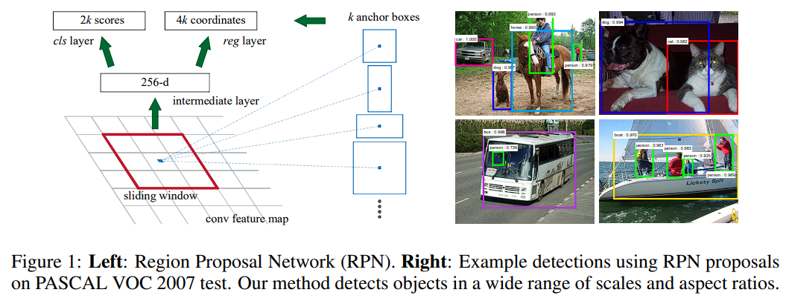

# Faster R-CNN: Towards Real-Time Object Detection with Region Proposal Networks

URL: https://papers.nips.cc/paper_files/paper/2015/hash/14bfa6bb14875e45bba028a21ed38046-Abstract.html

Authors
Shaoqing Ren, Kaiming He, Ross Girshick, Jian Sun

Abstract
State-of-the-art object detection networks depend on region proposal algorithms to hypothesize object locations. Advances like SPPnet and Fast R-CNN have reduced the running time of these detection networks, exposing region proposal computation as a bottleneck. In this work, we introduce a Region Proposal Network (RPN) that shares full-image convolutional features with the detection network, thus enabling nearly cost-free region proposals. An RPN is a fully-convolutional network that simultaneously predicts object bounds and objectness scores at each position. RPNs are trained end-to-end to generate high-quality region proposals, which are used by Fast R-CNN for detection. With a simple alternating optimization, RPN and Fast R-CNN can be trained to share convolutional features. For the very deep VGG-16 model, our detection system has a frame rate of 5fps (including all steps) on a GPU, while achieving state-of-the-art object detection accuracy on PASCAL VOC 2007 (73.2% mAP) and 2012 (70.4% mAP) using 300 proposals per image. Code is available at https://github.com/ShaoqingRen/faster_rcnn.

# Region Proposal Network

Conventional methods before Faster R-CNN uses computationally expansive methods like Selective Search, EdgeBoxes for object region proposal.
This paper proposes Region Proposal Network a deep net for object proposaㅣ.

A region proposal network takes an image as input and outputs a set of rectangular object proposals, each with an objectness score.
We model this process with fully convolutional network, which we describe in this section.

To generate region proposals, we slide a small network over the conv feature map output by the last shared conv layer.
This network is fully connected to an n x n spatial window of the input conv feature map.
Each sliding window is mapped to a lower-dimensional vector(256-d, 512-d).
This vector is fed into two sibling fully connected layers - a box regression layer (reg) and a box classification layer (cls).

We use n = 3 in this paper, noting that the effective receptive field on the input image is large (171 and 288 for ZF and VGG).

Note that because the mini network operates in a sliding window fashion, the fully connected layers are shared across all spatial locations.

This architectrue is naturally implemented with an n x n conv layer followed by two sibling 1 x 1 conv layers(for reg and cls respectively).

ReLUs are applied to the output of the n x n conv layer.

# Translation-Invariant Anchors

At each sliding-window location, we simultaneously predict k region proposals, so the reg layer has 4k outputs encoding the coordinates of k boxes.

The cls layer outputs 2k scores that estimate probability of object / not-object for each proposal.

The k proposals are parameterized relative to k reference boxes, called anchors.

Each anchor is centered at the sliding window in question, and is associated with a scale and aspect ratio.

We use 3 scales and 3 aspect ratios, yielding k = 9 anchors at each sliding position.

For a conv feature map of a size W x H (typically ~2,400) there are WHk anchors in total.

An important property of our approach is that it is translation invariant, both in terms of the anchors and the functions that compute proposals relative to the anchors.

References
- [1][Understanding and Implementing Faster R-CNN: A Step-By-Step Guide](https://towardsdatascience.com/understanding-and-implementing-faster-r-cnn-a-step-by-step-guide-11acfff216b0)